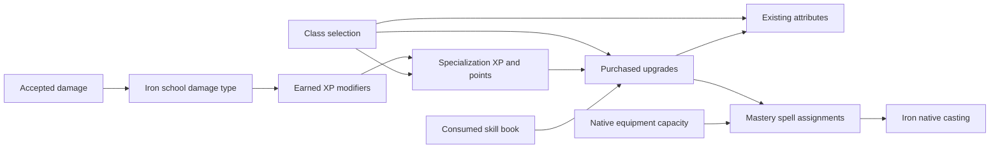

# Architecture

Mastery targets Minecraft 1.21.1 and NeoForge under `com.cappleapple.mastery`. Iron's Spells 'n Spellbooks and Better Combat are required. Patchouli is an optional presentation dependency for the guidebook.

## Authority and data flow

The server owns XP, levels, points, purchased ranks, book tokens, spell assignments, enabled modifiers, selected classes and pending starter rewards, and world-tier restrictions. Clients send intent; they cannot submit progression balances. The client owns its personal map layout.

`MasteryEvents` emits usage contexts after actual damage is applied. `SchoolDamage` compares the source against Iron's registered school damage types. Matching rules in `xp_sources` award XP to independent trees. `ExperienceModifiers` composes global and tree-specific attributes with active rank-scaled XP effects before the pure progression service runs. Administrative exact-XP changes and direct point grants skip that scaling. Promoted root gates apply before a source consumes its once-only reward. Level transitions award points according to each tree's rules; the defaults grant one per level.

Definitions load as immutable snapshots. Resources under `masteryedits` override matching `mastery` resources. `MasteryReloadListener.reloadOnly` also reads fresh files from the world's editor datapack, so `/mastery reload` and editor saves do not invoke Minecraft's full datapack reload. The loader checks schema, references, cycles, and runtime registry IDs before replacing a graph. Failed reloads retain the previous accepted snapshot. Player attachments persist progression and assignments; native mana and cooldowns are not copied into a second saved system.

## Classes and generated trees

`ClassService` begins join selection only when the server config enables it, class definitions exist, and the player has not selected a class. The saved selection state includes the player's original game mode and location. A server-validated choice applies the starting package once and restores that state. `PlayerProgress` format 4 stores the class ID, reward ledger, pending inventory deliveries, and any unfinished selection alongside progression. Attribute grants rebuild from the accepted class definition; they are not duplicated on login. See [classes](classes.md) for reset and reload behavior.

`PromotedTrees.expand` materializes a node's `root_tree` into a separate tree before point budgets and graph validation. It keeps the root's purchase identity and resolves descendant ownership in dependency order. The generated tree earns XP only while its purchased root and retained prerequisite gates are eligible. `CostResolver` excludes locked currencies from purchase plans, including costs paid from another owning tree. Generated tree IDs are stable proficiency keys; node IDs remain stable rank keys.

Definition synchronization retains the authored `root_tree` object and original descendant owners rather than serializing duplicate generated tree files. The client expands the same model. Generated layout anchors share the promoted node's position, while only the node icon is rendered; its outline reads the generated tree's XP. Layout refreshes when a prerequisite level or world tier changes. See [promoted roots](roots.md) for the data contract.

## Spells and equipment

`SpellService` validates assignments and invokes Iron's existing spell object. Iron's runs the cast and creates its effects. Mastery modifies native spell level, mana cost, cooldown, and cast time through native events and narrowly scoped integration mixins.

Equipment adapters read native maximum spell capacity and functional Curios slots. Mastery writes assignments only into its player attachment, never into item spell containers. The native book/sword shortcut is blocked from bypassing Mastery unlocks. Better Combat supplies resolved two-handed classification.

`ChargeService` extends native cast timing and applies configured native spell-level, Fireball size/radius, and burst changes. Native mana and cooldown handling remains authoritative. `NativeSpellHud` supplies a read-only active-set view to Iron's HUD without mutating equipment selections.

`SettingsResolver` merges global, tree, spell, and node settings. `EditorSchema` describes form fields; recursive visual controls preserve the draft alongside the syntax-colored JSON editor. Unknown extension fields remain editable.

`EffectService` rebuilds transient attribute and declarative effects from effective ranks and book gates. Provider and registry interfaces live in `api`, `requirements`, and `effects`.

## Map and editing

The normal map includes discovered independent roots. Nodes default to `available` visibility and enter the map and search results after their prerequisites are first met. The server records that reveal independently of point balance, so later condition changes do not erase revealed history. `GraphLayout` derives positions from dependencies, default sections, and stable saved anchors. Children persist relative offsets; movement cascades through all dependency parents using inverse-square distance weights. Root-sector changes rotate manual offsets. Synergy connections follow immediate prerequisites and project recursively to visible ancestors when those prerequisites are collapsed. Default growth points outward in eight compass directions relative to the fixed logical map center. The camera cannot change a root's sector. Players can toggle radial sector boundaries independently of graph connections. The renderer clips and culls graph content and caches layout outside rendering.

`GraphAnimation` handles transient branch motion. `ReadableZoom` separates display bounds while preserving a configurable minimum node width; neither animation nor collision avoidance changes saved graph coordinates.

`LayoutPreferences` stores local files keyed by world identity, server/save identity, and player UUID. These files never grant progression.

Operator edit mode belongs only to the requesting operator. It uses a separate transient layout with all definitions expanded in default order and orientation, bypassing discovery and book visibility gates. Node dragging is disabled in this view. `EditorService` validates requests and persists overrides under `<world>/datapacks/mastery-editor/data/<namespace>/masteryedits/<kind>/<path>.json`, then reloads only Mastery data. Failed edits restore previous files. The editor view and normal personal layout remain separate; accepted definition changes apply to the world.

`MasteryDatapackExport` serializes the last accepted raw resources, preserving original kinds, unknown author fields, and disabled tombstones. `/mastery export` transfers the bounded ZIP to the calling operator's client, where `ClientExport` saves it asynchronously under `config/exports/`. This path invokes neither a server disk export nor a reload.

Consumable `mastery:skill_book` items add persistent unlock tokens. `book_token` gates visibility, purchasing, and effective effects for a node and its dependency descendants; consuming a book grants no ranks or points.

## Damage and scripting

`ElementalDamage` partitions weapon hits before type-specific mitigation. `DamageTypes` resolves reloadable element definitions, mob memberships, and default weapon rules. Arrow launch snapshots retain the originating weapon's fractions and power. Supplemental portions use scoped damage sources and preserve the primary hit's cooldown state.

`MechanicsRuntime` queues successful hit, hurt, kill, and death events until the server tick's post phase. Trigger actions run under action, targeting, and recursion budgets. Keyword state is transient, expires by server tick, and clears at reload or unload. Native proc casts use separate casting data and retain their secondary origin through delayed projectile/entity ticks.

`CraftingService` modifies an output before it is copied or merged into an inventory. Persistent attempt markers prevent repeated extraction rolls. `PlacedComfortData` saves skill-derived placement bonuses per dimension and indexes them by chunk. The optional Needs Not Necessities adapter uses its public provider interfaces through reflection, so absence of that mod does not enter Mastery's class linkage.

The visual script editor stores ordinary definitions. It has no separate scripting interpreter or client-authoritative execution path. Server validation and edit permissions apply to card edits, forms, and JSON edits alike. Patchouli workshop visibility follows the server-authorized edit-mode state.
