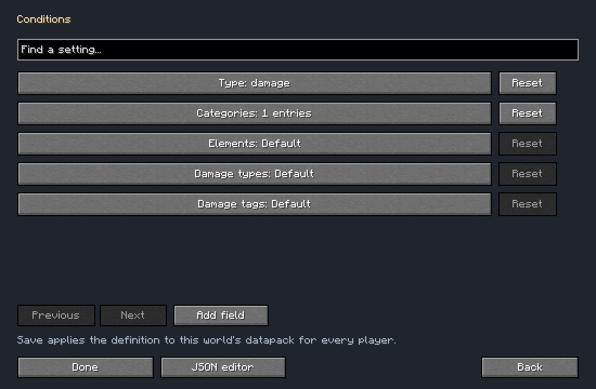
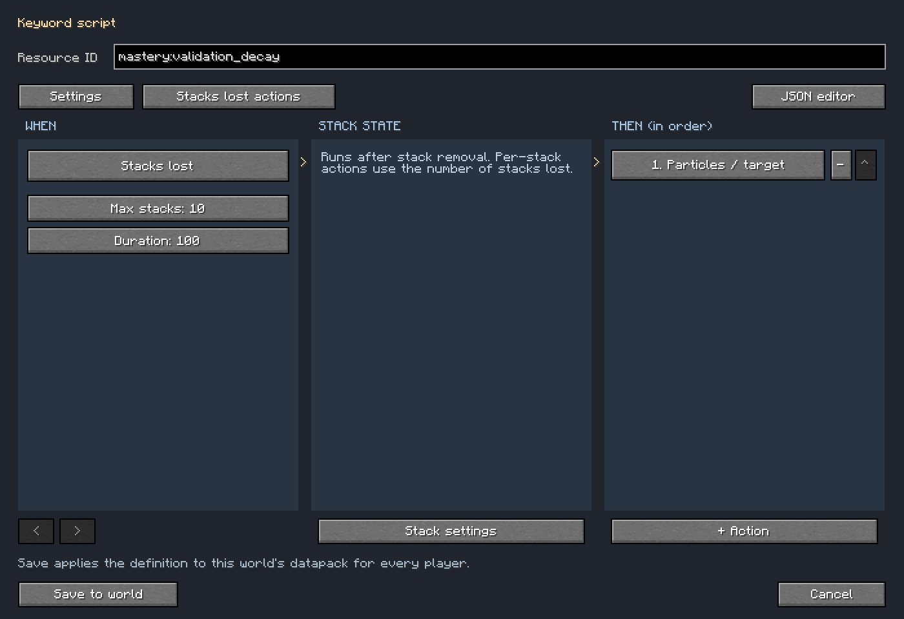

# Combat triggers and keywords

Mastery stores combat scripts in the same reloadable definition snapshot as skill trees. Pack authors can create them in the in-game visual editor or supply a datapack. Scripts run on the server. Definitions synchronize to clients for editing; damage, random rolls, cooldowns, and keyword state remain server-owned.

See [the visual editor](editor.md) for editing controls and [damage types](elemental.md) for elemental damage, conversion, and target matchups.

## Files and activation

| Definition | Datapack path | Example ID |
| --- | --- | --- |
| Trigger | `data/<namespace>/mastery/triggers/<path>.json` | `mastery:scorch_on_hit` |
| Keyword | `data/<namespace>/mastery/keywords/<path>.json` | `mastery:scorch` |
| Reusable node effect | `data/<namespace>/mastery/effects/<path>.json` | An author-selected ID |

A trigger does nothing until an active, purchased skill grants it. Add this object to the node's `effects` array:

```json
{"type": "mastery:trigger", "trigger": "mastery:scorch_on_hit"}
```

Reusable effects can hold the same object and be referenced through the existing `ref` mechanism. Skill eligibility, toggles, book gates, tree limits, prerequisites, and modifier-slot selection apply normally. If several active nodes grant the same trigger, it runs once per event and uses the highest effective rank. Its cooldown is shared by that trigger ID on that player.

The bundled Scorch modifier attaches to Fireball; Gathering Thunder attaches to Lightning Bolt. Both consume a modifier slot. Purchasing one does not grant a general on-hit passive: its trigger runs only when damage comes from that player's assigned spell. Scorch cannot proc from a sword, elemental weapon bonus, or another Fire spell. Thunder cannot proc from Fireball.

For a spell-bound trigger, set the node's `type` to `modifier`, select its native `spell`, and add a `mastery:trigger` effect. Modifier nodes default to the `mastery:native_spell` handler when `modifier` is empty or omitted. Set the active skill as a dependency to place the modifier beneath it. For example:

```json
{
  "tree": "mastery:fire",
  "type": "modifier",
  "spell": "irons_spellbooks:fireball",
  "dependencies": ["mastery:fireball"],
  "effects": [{"type": "mastery:trigger", "trigger": "mastery:scorch_on_hit"}]
}
```

Matching uses Iron's native spell damage source, including delayed projectile impacts, and captures the eligible assignments and slot budget at impact. Changing assignments before the queued event is processed cannot add a proc retroactively. Unattributed damage fails closed for modifier triggers. Incoming enemy spell damage does not use the victim's spell modifiers. Keyword ticks and secondary proc spells retain the normal recursion rules and do not borrow a spell's modifier assignments. Use a passive node for general hit, hurt, kill, or death scripts.

Existing purchases retain their ranks. If the modifier is not assigned, enable it with a free slot on its target spell.

The bundled `mastery:scorch`, `mastery:thunder`, `mastery:scorch_on_hit`, and `mastery:thunder_on_hit` definitions are templates. They do not add free combat abilities to players.

## Trigger definition

```json
{
  "name": "Scorch on hit",
  "event": "hit",
  "chance": 0.25,
  "cooldown": 10,
  "conditions": [
    {"type": "health", "target": "target", "unit": "fraction", "max": 0.5}
  ],
  "actions": [
    {"type": "keyword", "keyword": "mastery:scorch", "stacks": 1}
  ]
}
```

| Field | Default | Behavior |
| --- | --- | --- |
| `name` | Optional | Display name used by the editor and keyword hover lookup. |
| `description` | `""` | Optional tooltip description, followed by stats derived from the keyword script. |
| `event` | Required | `hit`, `kill`, `hurt`, or `death`. |
| `chance` | `1` | Base probability between 0 and 1. |
| `cooldown` | `0` | Ticks after a successful roll before the same trigger can run again. Maximum 72,000. |
| `conditions` | `[]` | All conditions must pass. |
| `actions` | Required | Nonempty ordered action list. |

A game tick is 1/20 second. Probabilities and percentage health use fractions: `0.25` means 25%.

`mastery:proc_chance` adds percentage points to a trigger's chance, then clamps the result to 0–1. A trigger with `chance: 0.25` and a `mastery:proc_chance` attribute bonus of `0.20` has a 45% chance. Grant the attribute through an ordinary skill attribute effect:

```json
{
  "type": "mastery:attribute",
  "attribute": "mastery:proc_chance",
  "amount": 0.05,
  "operation": "add_value"
}
```

The attribute effect scales with node rank. Trigger chance does not otherwise scale with rank. A successful roll starts cooldown even if the actions find no eligible targets.

## Events and health thresholds

| Event | Player (`self`) | Default `target` | When it runs |
| --- | --- | --- | --- |
| `hit` | Damage dealer | Damaged entity | Damage actually reduced health. |
| `hurt` | Damaged player | Living attacker, if present | Damage actually reduced the player's health. |
| `kill` | Credited killer | Dead entity | Death remained uncanceled and the victim is still dead at processing. |
| `death` | Dead player | Living killer, if present | The player is still dead at processing. |

Combat events are queued until the end of the server tick. Hit conditions capture health after damage. For a weapon hit split into multiple damage types, the completed hit refreshes the health snapshot after all its portions. Blocked, invulnerable, canceled, and fully absorbed hits do not produce `hit` or `hurt` events. A prevented death does not produce a confirmed kill/death trigger.

Hit and hurt actions process before confirmed kill/death actions in the event batch. Keyword damage and proc spell damage do not recursively produce `hit` or `hurt` triggers. Their confirmed kills and deaths can still produce `kill` and `death`, once per victim. This lets Scorch award an on-kill effect without making every Scorch tick apply another Scorch stack. Additional kills caused by an on-kill action are handled in a subsequent event batch.

Health conditions support either side and inclusive bounds:

```json
[
  {"type": "health", "target": "target", "unit": "fraction", "max": 0.25},
  {"type": "health", "target": "self", "unit": "points", "min": 4, "max": 10}
]
```

The first condition requires the enemy to be at or below 25% of maximum health. The second requires the player to have 4–10 health points. Two health points equal one ordinary heart. Omitted `min` means zero; omitted `max` means no upper bound. A condition aimed at a missing target fails. Thresholds are conditions evaluated on each event, not separate once-only health-crossing events.

Keyword conditions test current stacks:

```json
{"type": "keyword", "target": "target", "keyword": "mastery:scorch", "min": 3}
```

`min` defaults to 1, `max` to 1024. Use `max: 0` with `min: 0` to require absence. Conditions on a trigger use the event target. Conditions on an action use that action's selected target; `self` always refers to the player who owns the ability.

## Damage filters



Triggers and individual actions accept a `damage` condition:

```json
{"type":"damage","categories":["melee"],"elements":["mastery:fire"]}
```

This matches a melee hit containing fire damage. Combine it with a health condition for an on-hit health threshold. It also works on `kill`, `hurt`, and `death`.

| Field | Matches |
| --- | --- |
| `categories` | `melee`, `ranged`, `magic`, `physical`, `elemental` |
| `elements` | Mastery damage definition IDs or native Iron's school IDs, including physical definitions such as `mastery:slashing` |
| `damage_types` | Native damage IDs, such as `minecraft:arrow` |
| `damage_tags` | Native damage-type tags, such as `minecraft:is_projectile` |

Entries within a list are alternatives. Every populated list must match; omitted or empty lists do not restrict the event. At least one filter is required. To require both melee and magic, use two damage conditions. The visual editor provides registry selectors for each list.

Melee means a native player or mob attack, including its converted damage. Ranged means a projectile entity or damage tagged `minecraft:is_projectile`. Iron's school damage counts as magic and elemental; definitions without a school use their `elemental` flag. Native player/mob attacks, arrows, and tridents count as physical unless converted into another type.

Add native types to `data/mastery/tags/damage_type/is_magic.json` to extend `mastery:is_magic`. Its bundled values include vanilla magic, indirect magic, dragon breath, wither, and wither skull damage. School discovery happens at impact and includes registered addon schools.

Hit and hurt filters inspect the union of portions that actually dealt damage, with one proc attempt per attack. Immune or canceled portions do not qualify. Kill and death filters inspect the fatal portion. Equipment changes after impact do not change a queued event. Action filters inspect that same originating event, even when the action chooses nearby targets. Keywords retain the damage snapshot from their latest application. Their periodic, threshold, and stack-loss actions can test that snapshot; keywords applied directly through the Java API have no originating damage filter.

## Actions and targeting

Each action accepts these common fields:

| Field | Default | Behavior |
| --- | --- | --- |
| `type` | Required | Action type from the table below. |
| `target` | `target` | `self`, `target`, `nearby`, or `aim`. |
| `conditions` | `[]` | Per-selected-target conditions. |
| `chance` | `1` | Independent probability for this action, rolled once before selecting its targets. Proc chance does not modify this extra roll. |
| `radius` | `8` | Nearby radius or aim ray length, from 0.1 to 64 blocks. |
| `limit` | `16` | Maximum nearby targets, from 1 to 64. Closest entities are selected first. |
| `center` | `target` | For nearby selection, use `self` or `target`. Missing target falls back to self. |
| `include_allies` | `false` | Include allied entities in nearby/aim selection. |
| `include_players` | `false` | Include other players in nearby/aim selection, subject to player PvP rules. |
| `per_rank` | `false` | Multiply damage/healing amounts and applied keyword stacks by the granting node's effective rank. |
| `per_stack` | `false` | Multiply those quantities by the current keyword stack count. |

`self` selects the owner. `target` selects the event target, or the keyword bearer during keyword actions. Nearby selection uses actual distance, excludes the owner, and can select mobs around a corpse for kill/death explosions. Aim selection traces from the player's eyes, stops at blocks, and selects one living target. A spell action with `target: "aim"` also casts along the player's current view when the ray finds no living target.

| Type | Action fields | Behavior |
| --- | --- | --- |
| `keyword` | `keyword`, `stacks` (default 1), optional `duration` | Add stacks and refresh the keyword's expiry. |
| `remove_keyword` | `keyword`, `stacks` (default 0) | Remove the requested count. Zero removes the whole keyword. |
| `damage` | `amount` (default 0), `damage_fraction` (default 0), `element` or `school` | Deal typed damage. Default type is `irons_spellbooks:evocation`. |
| `heal` | `amount` (default 0), `element` or `school` | Heal a living target. Default type is `irons_spellbooks:holy`. |
| `effect` | `effect`, `duration` (default 100), `amplifier` (default 0) | Apply a registered vanilla/mod mob effect. Amplifier 0 means level I. |
| `spell` | `spell`, `level` (default 1) | Activate the registered native Iron's spell. |
| `lightning` | `amount` (default 0), `damage_fraction` (default 0), optional `element` or `school` | Create visual lightning and deal typed damage only to selected targets. Default type is `irons_spellbooks:lightning`. |
| `particles` | `particle`, `count` (default 12), `spread` (default 0.5), `speed` (default 0) | Send simple particles around the selected target. |

`element` accepts an element definition ID such as `mastery:slashing` or a registered Iron's school ID. `school` remains an alias; if both are supplied, the nonempty `element` wins. Empty optional selectors use the school or action default. Typed damage and healing use the same Mastery power and target-matchup rules as the damage system. Explicit `amount` is the starting value; it is not pre-multiplied by Iron's native spell-power attributes. Native spell actions use the spell's own normal power calculation.

For damage and lightning, starting damage is `amount + triggering_hit_damage × damage_fraction`, then `per_rank` and `per_stack` apply. Keyword ticks and threshold actions have no original hit amount, so their `damage_fraction` contributes zero. Successful hit damage includes the applied health damage of all weapon portions; health thresholds use the same completed hit. Use a fixed amount for keyword DOT and explosions.

Examples:

```json
{"type": "effect", "effect": "minecraft:slowness", "duration": 60, "amplifier": 1}
```

```json
{"type": "spell", "spell": "irons_spellbooks:firebolt", "level": 2, "target": "target"}
```

```json
{"type": "damage", "element": "mastery:slashing", "damage_fraction": 0.2}
```

The lightning action uses a visual-only vanilla bolt, with its damage applied through the selected damage type. It does not burn blocks, convert mobs, or damage arbitrary entities under the bolt. A native lightning spell retains that spell's own behavior.

Particles must be registered simple particle types, such as `minecraft:flame`, `minecraft:explosion`, or `minecraft:electric_spark`. Particle types requiring extra arguments, such as dust colors, are rejected by runtime validation. Use `count` from 1 to 256, `spread` from 0 to 16, and `speed` from 0 to 10.

### Native spell activation

A spell action calls the native spell's preconditions, cancelable pre-cast event, server pre-cast callback, and one `onCast` callback. Level modifiers and the cast event run normally. The action provides separate cast data, does not replace an existing channel, does not spend mana, and does not start a spellbook cooldown. Control proc frequency with the trigger's own chance and cooldown. The spell must be registered and enabled; proc abilities do not require a spellbook assignment or skill unlock for that spell.

When a target is selected, the player's server-side aim points toward that target for the callback and is restored immediately afterward. This directs native projectiles and raycasts; it does not change a self-cast spell into a targetable spell. Native area effects retain their own hit filters and radius, even if the action selected one target.

A continuous spell receives one activation, not an automatically maintained channel. Spells requiring repeated cast ticks, later player recasts, or custom addon cast state need a suitable native spell implementation. Those extended lifecycles are not synthesized by the proc engine.

## Keywords, DOT, and thresholds

Keywords are temporary named stack counters attached to living entities. They are independent of Minecraft mob effects. A keyword can tick actions, fire actions when it crosses a stack threshold, or act only as a condition for another ability.

`data/mastery/mastery/keywords/scorch.json` implements a stacking DOT that explodes at five stacks:

```json
{
  "name": "Scorch",
  "max_stacks": 10,
  "duration": 100,
  "tick_interval": 20,
  "tick_actions": [
    {"type": "damage", "school": "irons_spellbooks:fire", "amount": 1, "per_stack": true},
    {"type": "particles", "particle": "minecraft:flame", "count": 4, "spread": 0.25}
  ],
  "threshold": 5,
  "consume_stacks": true,
  "threshold_actions": [
    {"type": "particles", "particle": "minecraft:explosion", "count": 8, "spread": 0.75},
    {"type": "damage", "target": "nearby", "radius": 4, "limit": 16, "school": "irons_spellbooks:fire", "amount": 8}
  ]
}
```

Each stack contributes one starting fire damage every 20 ticks. Adding a stack refreshes the whole keyword to 100 ticks, without postponing an already scheduled DOT tick. Reaching five stacks consumes five and deals area fire damage with explosion particles. The affected entity is included if it is an eligible nearby target. The explosion does not destroy blocks.

| Field | Default | Behavior |
| --- | --- | --- |
| `name` | Optional | Display name used by the editor and keyword hover lookup. |
| `description` | `""` | Optional tooltip description, followed by stats derived from the keyword script. |
| `max_stacks` | `1` | Stack cap, from 1 to 1024. |
| `duration` | `100` | Ticks until the keyword expires, from 0 to 72,000; zero disables expiry. |
| `tick_interval` | `20` | Ticks between tick actions, from 1 to 72,000. |
| `tick_actions` | `[]` | Actions run on each scheduled tick. |
| `threshold` | `0` | Stack count that triggers threshold actions. Zero disables the threshold. Must not exceed the cap. |
| `consume_stacks` | `true` | Remove exactly the threshold count before running its actions. |
| `threshold_actions` | `[]` | Ordered actions run when stacks cross the threshold from below. |

A nonconsuming threshold fires only on crossing. It does not repeatedly fire while the keyword stays at or above the threshold. Removing stacks below the threshold, or expiration, rearms it. A consuming threshold retains any remainder. One application fires at most one threshold activation for that keyword, even when the application adds several thresholds' worth of stacks.

The keyword remembers the most recent applying player's ownership and effective rank. DOT and resulting kills use that owner. New applications from a different player transfer attribution. Duration is refreshed for all stacks together. Expired stacks are invisible to conditions immediately, even before cleanup runs.

### Thunder stored on the player

The bundled `mastery:thunder_on_hit` trigger adds `mastery:thunder` to `self` on every successful hit. At five stacks, the keyword removes five stacks and strikes up to four nearby mobs within eight blocks. Because the keyword is on the player, its default nearby center is the player.

This uses the same keyword engine as enemy DOT. To build another interaction, combine counters with per-action keyword conditions. For example, an action can require `mastery:scorch` on its selected target, remove those stacks, then apply a different keyword that your datapack defines. Every referenced keyword must exist in the same valid definition snapshot.

## Healing integration

Direct `heal` actions use their selected element's healing multiplier. Iron's native `SpellHealEvent` announces a school, caster, target, and amount but cannot modify healing itself. Mastery matches that announcement to the immediately following `LivingHealEvent` for the same target, tick, and exact amount, then applies the school multiplier once.

This covers native spells that emit the announcement, including Holy healing and Ice Tomb healing. Ordinary hunger, regeneration, and other unannounced heals receive no school scaling. An addon must emit a matching native `SpellHealEvent` immediately before its heal to participate. Announcements expire at the end of the tick; a different amount consumes and discards the pending announcement rather than applying it to an unrelated heal.

## Reloads, limits, and debugging

Definitions are validated as one snapshot. Invalid events, selectors, numbers, references, thresholds, native spells, effects, and particles reject the candidate. The previously valid definitions stay active. The in-game editor reports those errors before a saved definition is applied. Regular datapack reload and the Mastery editor both use the same validation.

Keyword stacks and proc cooldowns are temporary. They reset on definition reload or server shutdown. Logout, respawn, dimension departure, entity death/unload, or losing the owner removes affected live keyword state. They are not serialized into saved entities and do not produce mob-effect icons.

Execution is bounded to 2,048 queued combat events and 8,192 selected-target actions per server tick. A chain may nest 16 keyword thresholds. Each definition permits 64 actions per list and 32 conditions; an entity may hold 64 keywords, and at most 4,096 entities may hold live keywords. Runtime limits stop excess work. Design interactions so they finish well below those limits.

If a script appears inactive, check the granting node's effective rank and toggle, the trigger's event, inclusive health bounds, chance and cooldown, and whether its target exists. Then check keyword expiry and target filters. A registered native spell can still reject its own preconditions or be canceled by another mod. Unexpected action exceptions are logged as `Mastery combat action failed`; the rest of that action chain stops.


## Tree modifiers

Set a modifier node's `modifier` to `mastery:tree`. It activates when purchased and enabled, without occupying a spell modifier slot. Its `damage_filter` inherits from the owning tree. The bundled school trees each filter to their school. The Fire tree uses `elements: ["irons_spellbooks:fire"]`, so its tree modifiers apply only when the originating hit contains accepted Fire damage.

`data/example/mastery/nodes/fire_scorch.json`:

```json
{
  "tree": "mastery:fire",
  "name": "Scorching Fire",
  "type": "modifier",
  "modifier": "mastery:tree",
  "effects": [{"type": "mastery:trigger", "trigger": "mastery:scorch_on_hit"}]
}
```

This uses the bundled Scorch trigger, including its existing chance and cooldown. It affects Fire weapon damage and Fire skills in the Fire tree or its sub-trees. It does not turn non-Fire attacks into Scorch applications.

`inherit_subtrees` defaults to `true`. A promoted tree inherits from its root's owning tree and the trees of its prerequisite nodes, recursively. Flame Blade therefore inherits Fire and Two-Handed modifiers. Set `inherit_subtrees: false` on a tree modifier to restrict its spell scope to its direct tree. Weapon hits continue to use the damage filter. Global defaults, tree definitions, and individual nodes can set this option. An empty damage filter allows any damage type; native spells must still belong to the applicable tree. Damage-type filters and tree membership are separate requirements.

## Keyword bonuses

Add `mastery:keyword_modifier` effects to a passive, equipped spell modifier, or tree modifier. The modifier's normal activation and damage scope apply.

```json
{
  "type": "mastery:keyword_modifier",
  "keyword": "mastery:scorch",
  "stacks": 1,
  "stacks_percent": 0.25,
  "damage": 2,
  "damage_percent": 0.5,
  "duration": 20,
  "duration_percent": 0.25
}
```

All fields are optional except `type` and `keyword`. Flat bonuses and percentages scale by active rank and add across matching effects. The result is `(base + flat bonuses) × max(0, 1 + percentage bonuses)`, clamped to a nonnegative value. Percentages use fractions: `0.25` means +25%. Duration additions are ticks; 20 ticks is one second.

Fractional applied stacks roll for one additional stack: 1.25 stacks means one stack plus a 25% chance of a second. The keyword's maximum still applies. Damage bonuses affect keyword `damage` and `lightning` actions before their `per_rank` and `per_stack` scaling. They do not rewrite damage inside a native spell action. Stack and duration bonuses are evaluated on application; damage bonuses use the owner's currently active modifiers and the stored application source when the action runs.

## Duration, decay, and stack-loss events



Each keyword has one shared duration and one decay timer. Reapplying stacks refreshes both, even at the stack cap. Duration defaults to 100 ticks; `duration: 0` lasts until consumed, removed, or fully decayed. Entity removal, owner logout, server stop, and definition reload clear temporary keyword state without running loss actions.

| Field | Default | Behavior |
| --- | --- | --- |
| `decay_delay` | `0` | Ticks after application before the first loss; zero begins on the next tick. |
| `decay_stacks` | `0` | Stacks removed per decay step; zero disables decay. |
| `decay_interval` | `20` | Ticks between subsequent losses. |
| `stacks_lost_actions` | `[]` | Runs after any removal, including decay, expiry, threshold consumption, and `remove_keyword`. |
| `all_stacks_lost_actions` | `[]` | Also runs when that removal empties the keyword. |

Loss actions use the original owner and target. `per_stack` uses the number actually removed, including the final partial decay step. The removal happens before callbacks; the ordinary action/depth limits also apply to callbacks that apply another keyword. Expiry removes all remaining stacks in one event.

```json
{
  "name": "Fading Scorch",
  "max_stacks": 10,
  "duration": 0,
  "decay_delay": 60,
  "decay_interval": 20,
  "decay_stacks": 1,
  "tick_interval": 20,
  "tick_actions": [{"type": "damage", "element": "mastery:fire", "amount": 1, "per_stack": true}],
  "all_stacks_lost_actions": [{"type": "particles", "particle": "minecraft:smoke", "count": 8}]
}
```

The visual keyword editor has four action lanes: **Tick actions**, **Threshold actions**, **Stacks lost actions**, and **All stacks lost actions**. Use **Stack settings** for duration and decay fields. Node effect editors expose all six keyword bonus fields and a keyword selector.
