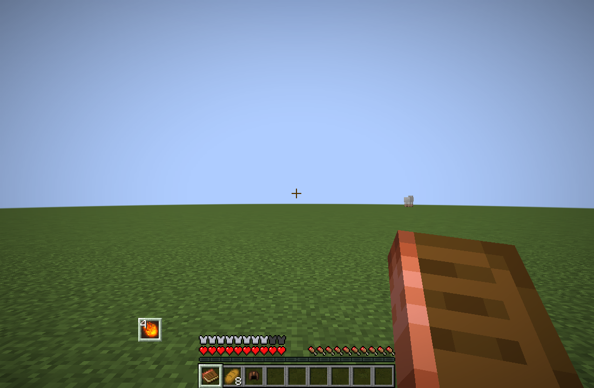

# Spell slots and upgrades

Mastery assigns and upgrades existing Iron's Spells 'n Spellbooks spells. Iron's owns their mana, cooldowns, casting state, projectiles, and effects. Mastery binds the installed native spells rather than registering replacement spell implementations.

## Assignment and capacity

Open **Spells** in the skill map and choose a mode:

- **Hotbar sets:** each of the nine hotbar positions has its own assignments. Selecting that position activates its set.
- **Quick cast:** one shared set remains active across all hotbar positions.

The modes retain separate saved arrangements. Only the selected mode consumes its capacity budget. Within hotbar mode, assignments across all nine positions share that budget, including repeated assignments of the same spell. The hotbar editor shows positions 1-9 above four slots, with each slot's current control beneath it. Each hotbar position has at most four assigned spells, with no slot pages. Older hotbar sets keep only their first four assignments; purchased spells remain unlocked. Slots with no remaining capacity are dimmed and cannot be selected. Quick-cast mode uses a grid of available slots. Existing assignments can be replaced or cleared.

Four remappable hotkeys default to **Q**, **E**, **F**, and **C**. **[** and **]** select further pages in quick-cast mode only; hotbar sets always use their four fixed slots. Iron's standard spell HUD displays the active hotbar set or the shared quick-cast set. The assignment screens use Iron's slot textures and native spell icons.

Capacity comes from functional equipped native spell containers, `baseActiveCapacity`, and progression bonuses. The common bonus defaults to zero. Native capacity uses maximum container slots, not inscription count. Assignments never write into book or item containers. Books keep their attributes; existing inscriptions are preserved but cannot bypass Mastery unlocks. Native scrolls remain consumables.

The server checks ownership, capacity, the active set, and world-tier restrictions before initiating Iron's native cast. Iron's checks mana, cooldowns, and casting restrictions. Legacy weapon-context assignments migrate into the shared quick-cast arrangement. Combat contexts still classify weapon usage XP, including Better Combat's exclusive two-handed classification.

Active spell details show the name, Iron's localized Scroll Forge description, rank, current native spell stats, and equipped modifier effects. Authored node descriptions do not replace or repeat the native spell description. Damage and other spell-specific stats use Iron's `getUniqueInfo` at the effective prepared level. The server supplies modified mana cost, cast time, and cooldown, including Tempo recharge normalization and per-spell cooldown overrides when installed. Target-specific resistances and charge-dependent outcomes still depend on the actual cast and target.

Enabling, disabling, or upgrading a spell-level modifier updates the prepared `SpellData`, the native HUD, and Tempo Not Time's charge snapshot. Existing recharge timers keep their original cast data, while the displayed charge capacity follows the current prepared level. Tempo remains optional. Its synchronized mana-disabled state hides mana costs, including in `SPELL_COOLDOWNS` mode.

Unbought modifier nodes are hidden when none of their eligible, owned spells has a free modifier slot. Purchased modifier nodes remain visible so they can be toggled. The editor shows all modifier nodes. Slot availability does not bypass purchase costs or prerequisites.

Equipped scripted modifiers append their effects, such as `Scorch on hit (25%)`. Hover a keyword's name for its definition. The same keyword lookup works in descriptions, guide pages, and standard text tooltips; keyword-containing tooltips stay in place while the pointer moves into them.

## Charge upgrades

Repeated purchases of a spell's unlock node increase its charge rank. Each rank adds `ticks_per_level` ticks to the optional hold window, up to `max_levels`. The native cast time is still the minimum; an instant spell uses `instant_base_ticks` instead. Releasing early finishes after any remaining minimum time. Holding through the entire window completes automatically. The native cast bar fills from 0% to 100%, with segments at charge-level thresholds. Markers use the server's actual preparation time and charge window. Continuous native spells keep their own channel behavior.

Charge strength is `clamp((held_ticks - base_ticks) / ticks_per_level, 0, charge_rank)`. Fractional stages affect Fireball size and radius; extra cast count and optional native spell-level bonuses are rounded down.

Built-in presets:

- `irons_spellbooks:fireball`: enabled, 20 ticks per rank, 50% more visual size and explosion radius per stage.
- `irons_spellbooks:firebolt`: enabled, 20 ticks per rank, one extra native cast per stage, three ticks between bursts.
- Other spells: charging disabled until enabled by data.

The Firebolt preset applies when a pack creates a binding and unlock node for that existing spell; the bundled Fire tree binds Fireball. Bursts call the existing native spell behavior and share the initial cast's mana payment and cooldown. They stop on death, logout, dimension change, revoked ownership, or a new cast/assignment that interrupts them. Fireball visual scale is capped at 16 and explosion radius at 64; bursts are capped at 64 extra casts.

Base native spell levels remain independent of charge ranks. `level` defines the binding's starting native level; an `unlock_spell` effect can supply a higher rank-based starting level, and `spell_level` modifiers add further levels. The data default `charge.spell_levels_per_stage: 1` adds one native spell level per completed held stage above that modified base. Set it to `0` to retain size, radius, or burst scaling without increasing native level. The held bonus applies only to that cast; the prepared spell keeps its base level. Native mana is charged once at the final cast level.

With Tempo charges enabled, a held cast consumes `ceil(held_casting_draw / base_casting_draw)` base-spell charges, with a minimum of one. Tempo's own Casting Draw calculation supplies both costs, including spell overrides and events. A thick yellow line marks each point where the cost rises to another charge; ordinary held-stage markers remain thin. The server caps held strength at the highest affordable native level if charges are unavailable. Creative charge bypass and spells excluded from Tempo charges keep one-charge behavior.

Paid charges use Tempo's normal recharge and persistence rules. The final cast's Casting Draw and recovery cost are divided between those charges, so consuming two charges does not double its reserve debt. Extra Firebolt burst projectiles share that paid cast. Early cancellation commits no extra recharge.

## Inherited settings

Global defaults live at `data/mastery/mastery/settings/defaults.json`. Settings merge in this order: built-ins, global defaults, owning tree, spell binding, granting node. Missing fields and literal `"default"` inherit. Nested fields merge individually. If multiple nodes grant a spell, the eligible node with the highest rank supplies node overrides, with ID ordering for ties.

A charge override on a tree, spell, or node can contain:

```json
{
  "charge": {
    "enabled": true,
    "ticks_per_level": 20,
    "instant_base_ticks": 10,
    "max_levels": 16,
    "spell_levels_per_stage": 1,
    "fireball_size_per_stage": 0.5,
    "fireball_radius_per_stage": 0.5,
    "extra_casts_per_stage": 0,
    "burst_interval_ticks": 3
  },
  "modifier_slots": {"base": 2, "per_level": 1, "max": 64}
}
```

Durations use game ticks (20 per second). `ticks_per_level` accepts 1-1200; `instant_base_ticks` 0-1200; `max_levels` 1-64; burst intervals 1-200. Scaling values accept 0-16.

Modifier capacity is `min(max, floor(base + (level - 1) * per_level))`, plus progression bonuses and subject to tier caps. Its level is the greater of the highest active grant's native base level and granting-node rank, plus matching active passive and equipped spell-level modifiers. The default is two slots at level one, then one per additional level. A legacy numeric `modifier_slots` sets the base while retaining inherited growth.

## Native modifiers

A node with `type: "modifier"` targets a `spell` and uses a modifier slot. Its `modifier` handler defaults to `mastery:native_spell`; an explicit registered handler can override it. Native parameter changes use a `mastery:spell_modifier` effect:

```json
{
  "type": "mastery:spell_modifier",
  "spell_level": 1,
  "mana_multiplier": 0.9,
  "cooldown_multiplier": 0.9,
  "cast_time_multiplier": 0.9
}
```

With optional **Tempo Not Time**, add charges using:

```json
{"type":"mastery:spell_modifier","extra_charges":2}
```

Set this effect on a modifier node targeting the desired spell, for example a node at `data/<namespace>/mastery/nodes/<path>.json` with `type: "modifier"` and `spell: "irons_spellbooks:fireball"`. The visual effect editor exposes **Extra charges** under `mastery:spell_modifier`.

`extra_charges` accepts whole numbers from 0 to 10,000 and adds that many charges per enabled rank. Multiple active sources add together, capped at 10,000 bonus charges per spell. Modifier nodes require assignment and a free modifier slot. Passive nodes can use the same effect with an optional `spell` filter. Charge bonuses do not change spell level or the hold-to-charge window.

Mastery adds to the current value in Tempo's public `com.cappleapple.temponottime.api.event.ChargeCalculationEvent`, preserving prior event adjustments. The hook runs after Tempo's base calculation and configured charge cap. Changes refresh the prepared spell's charge display even if its level is unchanged. Existing recharge timers are retained. Spell stats show `Charges: <maximum>` from Tempo's server calculation, including unslotted skills. The value refreshes after modifier changes and when attributes or charge settings change; it is maximum capacity, not remaining charges. Without Tempo installed, the definitions remain valid but grant no additional casts.

Modifier nodes can also carry [combat trigger effects](mechanics.md#files-and-activation). These react only to damage attributed to their assigned spell. Scorch modifies Fireball; Gathering Thunder modifies Lightning Bolt.

Include only the fields being changed. Spell levels add per active rank; multipliers compound per rank. Purchased modifiers must be enabled and fit the available slots. Disabling an ancestor's effects does not disable its descendants or erase investment. Book gates, purchased-rank prerequisites, and world-tier restrictions still apply.

Newly purchased nodes start enabled. New spell modifiers also activate automatically when their spell has an available modifier slot. Later ranks preserve a node's enabled/disabled choice.

The required Apothic Attributes integration uses `apothic_attributes:arrow_damage` for the Bow practice node and `apothic_attributes:arrow_velocity` for Crossbow practice. These modifiers apply only in the matching weapon context; Apothic handles the native projectile scaling.

## Combined skill nodes

A node's `effects` array can contain multiple attributes, crafting bonuses, triggered effects, spell unlocks and spell upgrades. Its purchased rank and active state apply to every entry. The node's presentation `type` does not limit how many effect kinds it can contain.

For example, `data/example/mastery/nodes/elemental_apprentice.json` can use the bundled Fireball and Icicle bindings:

```json
{
  "tree": "mastery:fire",
  "name": "Elemental Apprentice",
  "type": "active",
  "max_rank": 3,
  "cost": 1,
  "effects": [
    {
      "type": "mastery:unlock_spell",
      "spell": "irons_spellbooks:fireball",
      "level": 1,
      "levels_per_rank": 1
    },
    {
      "type": "mastery:unlock_spell",
      "spell": "irons_spellbooks:icicle",
      "level": 1,
      "levels_per_rank": 0
    },
    {
      "type": "mastery:attribute",
      "attribute": "minecraft:generic.max_health",
      "amount": 2
    },
    {
      "type": "mastery:spell_modifier",
      "spell": "irons_spellbooks:fireball",
      "mana_multiplier": 0.9
    }
  ]
}
```

Each spell must have a binding at `data/<spell namespace>/mastery/spells/<spell path>.json`. The example references existing native registry IDs and bundled bindings; it does not create new spells. Both spells become available from one node and each consumes an ordinary active slot when assigned. Per-tree preparation limits use each spell binding's tree, even when the granting node belongs to a different tree.

An `unlock_spell` effect accepts integer `level` from 1–255 (default 1) and `levels_per_rank` from 0–255 (default 0). Its starting native level is `level + levels_per_rank × (effective rank − 1)`, capped at 255. The spell uses the maximum of its binding's base level and every active grant, so multiple grants do not add their starting levels together. Existing singular node `spell` fields retain their earlier behavior: additional ranks increase charge progression and do not independently raise native base level.

A `mastery:spell_modifier` effect on an ordinary node is a passive upgrade and consumes no modifier slot. Include `spell` to affect one bound native spell, or omit it to affect every spell that player actively owns. Each matching entry adds its level changes and multiplies its mana, cooldown and cast-time changes independently. Two entries no longer overwrite matching field names. Rank scales each entry, so two `spell_level: 1` entries on a rank-2 node add four levels.

An equipped modifier node still uses `modifier: "mastery:native_spell"` and consumes a modifier slot. It may name its target in the singular node `spell` field, or provide explicit `spell` filters in its `mastery:spell_modifier` effects. A modifier with multiple explicit targets can equip for all those spells when each has capacity. Per-spell activation remains independent: removing it from one spell does not disable its other equipped targets. Effects with a mismatched filter never leak into another spell.

Disabling an ordinary combined node turns off its passives and active spell ownership together, while preserving purchased ranks and saved assignments. Other purchased nodes can still grant the same spell. Existing prerequisite, book-unlock and world-tier gates continue to apply.
## HUD addons

Mastery supplies its prepared spell list throughout Iron's native spell-bar render. Addon render callbacks reading `ClientMagicData.getSpellSelectionManager()` see the same spells and slot ordering. Outside that render, the native equipment selection is unchanged. Charge counts and cooldown graphics remain the owning addon's responsibility.

The optional Tempo Not Time adapter (tested with 1.2.6) includes prepared skill spells in its server charge snapshots and refreshes those snapshots when the active loadout or spell levels change. This exposes full charges before the first cast, as well as updates after spending and recovering them. No Tempo classes are required to load Mastery.


